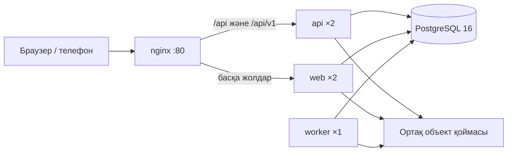

# Платформа архитектурасы

## Қызметтер

`web` және `api` — бір TypeScript/Next.js образының екі рөлі. nginx сұранысты бөледі; бұрынғы `/api/*` сақталады, `/api/v1/*` жаңа клиенттерге арналған. Қазіргі рендер маршруты бұрынғыша тікелей жауап береді; `/api/v1/jobs` рендер, XLSX және монтаж синхронын кезекке қабылдайды. `worker` кезекті PostgreSQL-дегі `FOR UPDATE SKIP LOCKED` арқылы алады. Үш рет сәтсіз болған тапсырма `failed` күйінде қалады. Тапсырма нәтижесіндегі файл кілті тек сол цехтың аккаунтымен оқылады.

Қойма `S3_BUCKET` берілсе S3/R2/MinIO, әйтпесе `DATA_DIR/objects` дискі. Диск режимінде барлық реплика **бір хосттағы бір томды** қолдануы керек; көп хостқа шыққанда ортақ S3/R2 қоймасын орнату қажет. Қолданыстағы телефон фотолары SQLite/PostgreSQL кестесінде сақталады; жаңа файл API-і `/api/v1/objects/*` арқылы объект қоймасын қолданады. Әр объект жолында цех ID-і бөлек префикс, сұраныс cookie-дегі цехпен тексеріледі. 25 МБ шегі бар.

## Орта мен құпиялар

| Атау | Мәні |
|---|---|
| `DATABASE_URL` | PostgreSQL URL. Болмаса SQLite әдепкі күйде қалады. |
| `DATA_DIR` | SQLite және жергілікті файл қоймасының жолы. |
| `POSTGRES_PASSWORD_FILE` | Docker secret ішіндегі DB паролі; entrypoint URL құрады. |
| `OPENAI_API_KEY_FILE` | Docker secret, ЖИ қызметтері үшін. |
| `SESSION_SECRET_FILE` | Docker secret, болашақ қолтаңбалы сессияларға резерв. Қазіргі сессиялар DB-де кездейсоқ токенмен сақталады. |
| `S3_BUCKET`, `S3_ENDPOINT`, `S3_REGION` | S3/R2/MinIO қоймасы. Бакет алдын ала жасалады. |
| `AWS_ACCESS_KEY_ID_FILE`, `AWS_SECRET_ACCESS_KEY_FILE` | S3 құпиялары; entrypoint AWS SDK айнымалыларын береді. |
| `PLATFORM_ADMIN_SHOP_ID` | Осы цех иесі глобал API метрикасы мен қате журналын көреді. Өзге иелер тек өз цехының аудитін көреді. |

Құпияның нақты мәнін репоға жазбаңыз. Жергілікті әзірлеуде `bash scripts/initDevSecrets.sh` құпия файлдарын жасайды, `docker compose -f docker/docker-compose.yml up --build` стекке қосады. Бұл пәрмен негізгі кезектің 06 e2e кезеңінде тексеріледі; осы параллель кезекте толық стек көтерілмейді. `docker/secrets/*.example` — тек үлгі. Swarm үшін `postgres_password`, `openai_key`, `session_secret` Docker secret-терін алдымен жасаңыз. TLS-ті nginx алдына тұрған ingress/прокси аяқтайды.

## Миграция және rollback

1. SQLite файлының көшірмесін алыңыз және жазуды тоқтатыңыз. `DATA_DIR/furniture.db` мен объект файлдарын бірге сақтаңыз.
2. Бос PostgreSQL 16 базасын жасаңыз. `DATABASE_URL` ортасы берілгенде `npx tsx scripts/migrateSqliteToPostgres.ts /path/to/furniture.db` кестелерді нұсқаланған `docker/migrations/*.sql` арқылы құрады, деректі бір транзакцияда көшіреді, әр кестенің санын тексереді. Мақсат кестелер бос болмаса тоқтайды. Құпия URL-ді shell history-ге жазбаңыз.
3. Staging-те `DATABASE_URL` орнатып, API/worker health пен жобалар, монтаж, share, келісім, файлдарды тексеріңіз. Әр процесс іске қосылғанда жаңа SQL миграциясын advisory lock ішінде бір рет орындайды.
4. GitHub-та `production` environment үшін required reviewers орнатыңыз. Серверді GHCR-ге алдын ала кіргізіп, `DEPLOY_HOST`, `DEPLOY_USER`, `DEPLOY_SSH_KEY`, `DEPLOY_KNOWN_HOSTS` құпияларын орнатыңыз. Production-ға тек GitHub Actions `workflow_dispatch` және environment мақұлдауымен шығыңыз. Workflow тест, typecheck, build аяқталған соң GHCR образына SHA тегін береді, содан кейін `docker stack deploy` жасайды. Автоматты push production-ды өзгертпейді.
5. Қайту: алдыңғы GHCR SHA тегін `PLATFORM_IMAGE` етіп қайта deploy жасаңыз. **SQL миграциясы автоматты кері қайтпайды.** Сәйкес емес схема болса DB snapshot-ты қалпына келтіріңіз. SQLite-ке қайту үшін көшірілген бастапқы файлға тек жазу тоқтатылған уақыттан кейінгі PostgreSQL өзгерістерін бөлек көшіру керек; ескі файлды үнсіз қосуға болмайды.

## Бақылау

`/admin/observability` иеге цехтың жоба, тариф/баға, рөл және келісім өзгерістерін көрсетеді. Платформа әкімшісінің цех ID-і орнатылса API v1 сұраныстарының latency/status және сервер қателері де көрінеді. `/api/health` DB байланысын тексереді. Метрика және қате кестелері шексіз өспеуі үшін сақтау мерзімін кейін бөлек purge job-пен бекіту керек.

## Жергілікті тексеріс

SQLite режимі: `NODE_OPTIONS=--max-old-space-size=2048 npx vitest run tests --maxWorkers=2`. PostgreSQL режимінде жеке бос тест базасына `DATABASE_URL` және `PG_TEST_SCHEMA_PREFIX=vitest` беріңіз; екіншісі әр тест файлының уақытша `DATA_DIR` мәнін бөлек PG схемаға айналдырады. `tests/postgresPlatform.test.ts`, `tests/postgresMigration.test.ts`, `tests/jobsPlatform.test.ts` және серверлік маршрут тесттері соны тексереді. Толық compose және браузер e2e негізгі кезектің 06 кезеңіне қалдырылған.
