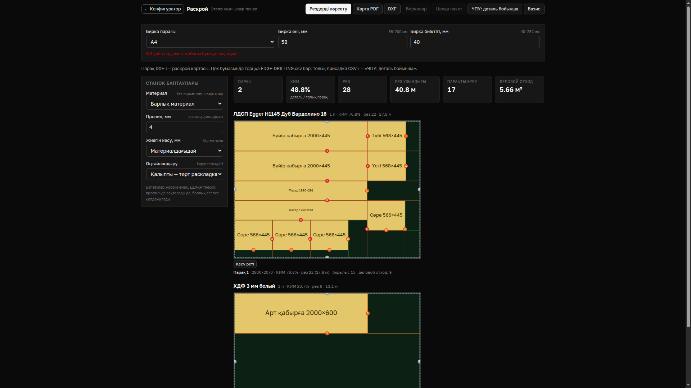

# AisMebel: пайдаланушы нұсқаулығы

Экрандағы батырма атаулары орысша берілген. Шкаф габаритін әрқашан **H × W × D** ретімен, бүтін миллиметрмен енгізіңіз: мысалы, 2000 (H) × 600 (W) × 450 (D). «Готовый» — жиналған деталь, «Рез» — араға берілетін өлшем; оларды алмастырмаңыз.

## 10 минутта бастау

1. Интернет барда `/configurator` ашыңыз. «Аккаунт» арқылы цех иесі тіркеледі; «Команда» бөлімінде дизайнерге не цех қызметкеріне шақыру жасайды. Телефонда бірінші рет кіргенде де интернет керек.
2. «Создать» мәзірінен шаблон таңдаңыз немесе бөлме мен корпусты жасаңыз. Өлшемді, материалды, фасадты, сөрені және кромканы тексеріңіз. «Проект → Сохранить» JSON файлын жүктейді; аккаунттағы «Проекты в облаке → Сохранить текущий» бұл жобаны серверге сақтайды.
3. «Смета и раскрой → Стоимость» бөлімінде цех бағаларын тексеріп, «КП» PDF-ін жүктеңіз. Баға толық болмаса, КП шықпайды. «Проект → Ссылка клиенту» арқылы 3D сілтемесі мен кодын беріңіз.

| Кім | Алғашқы әрекет | Қазіргі кіру рөлі |
|---|---|---|
| Иесі | «Аккаунт → Команда» арқылы шақыру, «Настройки цеха» ішінде материал/баға/өндіріс ережесін тексеру | `owner` |
| Менеджер | Клиент дерегін «Проект → Реквизиты» ішіне жазып, КП мен келісу сілтемесін жіберу | Жеке рөл жоқ; жоба өңдеу үшін `designer` |
| Өлшеуші, телефон | `/mobile` → «Новый замер»: бөлме мен төрт қабырғаның өлшемін, кедергілерді және фотоны енгізу; «Сохранить замер» | Жеке рөл жоқ; `designer` не `owner` |
| Дизайнер | Өлшеуді ашып, «Новая КП»/`/configurator` арқылы жоба жасау; 3D, деталь, присадканы тексеру | `designer` |
| Распил/CNC | `/cut` ішінде материал, парақ, пропил, қалдықты қарап, «PDF карты», «DXF», «ЧПУ по деталям» не «Всё для цеха» жүктеу | `shop` өндіріс дерегін оқиды; экспортқа рөлдік шектеуді бөлек тексеріңіз |
| Кромка | «Бирки» мен деталировкадағы L1/L2/W1/W2 жақтарын, материал мен «Рез» өлшемін сәйкестендіру | `shop`; жеке кромка мәртебесі жоқ |
| Монтажник, телефон | `/mobile → Монтаж`: фото, клиент қолы, ақау актісі, жөндеу тапсырмасы; соңында «Завершить монтаж» | `shop` не `owner` |
| Клиент | Шебер жіберген `/c` коды немесе сілтеме арқылы 3D көру; пікір жазу, келісу үшін бөлек 6 таңбалы код енгізу | Ортақ сілтеме; цех командасына кірмейді |

`shop` рөлі ішкі бағаны көрмейді және жобаны өңдемейді. Өлшеуші мен монтажникке ортақ аккаунт бермей, нақты міндетіне сай шақыру жасаңыз; өлшеуге қазір `designer`, монтажға `shop` қажет.

## Тапсырыстың жолы

1. **Өлшеу.** `/mobile` ішіндегі «Новый замер» шеберінде әр қабырға мен кедергіні толтырып, талап етілген фотоны тіркеңіз. Дауыс пен лазер белгісі тек санның *қайдан алынғанын* көрсетеді; санды адам енгізеді. Желісіз замер телефонда сақталып, кезекке түседі. «Ожидает отправки» нөл болғанын тексеріңіз.
2. **Жоба.** `/configurator` ішінде корпусты орналастырыңыз, 3D және «Деталировка» нәтижесін қараңыз. «Проект → Реквизиты» ішіне клиентті, тапсырыс нөмірін, дизайнерді енгізіңіз; жоба JSON-ын сақтаңыз немесе аккаунт арқылы бұлтқа жазыңыз.
3. **КП.** «Настройки цеха» бағаларын толтырып, «Смета и раскрой → Стоимость → КП» PDF алыңыз. Материал, кромка, фурнитура, қызмет пен жеңілдікті қарап шығыңыз.
4. **Келісім мөрі.** «Проект → Ссылка клиенту → Отправить версию на согласование»: нақты соңғы соманы көрсетіп, бір рет көрінетін растау кодын клиентке беріңіз. Клиент желіде `/view` бетіндегі «Подтверждаю эту версию» батырмасын басады; содан кейін мөрленген PDF-ті жүктейді. Жоба өзгерсе, жаңа нұсқаны қайта жіберіңіз. Бұл нұсқа/баға мөрі; қағаз шартты автоматты жасамайды.
5. **Өндіріс.** `/cut` ішінде раскрой картасын және лист DXF-ін жүктеңіз. «ЧПУ по деталям» немесе әр деталь DXF-ін присадка үшін беріңіз. «Всё для цеха» архивінде раскрой, деталь DXF-тері, деталировка CSV және бирка бар. Кромканы биркадағы жақ белгісімен тексеріп, детальға бирканы жапсырыңыз. **Қазіргі `/cut → Бирки` PDF-інде QR жоқ**; QR салу өзекте бар, бірақ бұл батырмаға жоба ID-і мен нұсқасы қосылмаған. `/mobile/scan` QR-ды немесе кодты оқи алады, алдын ала жүктелген жобаны желісіз табады. QR бар өндірістік бирканы автоматты шығару — жоспарда.
6. **Монтаж.** `/mobile/installation` ішінде тапсырманы ашып, фото мен клиент қолын сақтаңыз. Ақау болса «Акт о дефекте» арқылы деталь мен фотоны тіркеп, жөндеу тапсырмасын жабыңыз; содан соң монтажды аяқтаңыз.
7. **Төлем.** КП сомасына сәйкес аванс пен қалдықты цех өз Kaspi Pay POS-ында қолмен шоттап, төлем тарихынан тексеріп, чек береді. AisMebel өзегінде бұл есептің моделі бар; қолданбада төлем қабылдау, банк мәртебесін автоматты тексеру және тапсырыстың төлем журналы **жоспарда**. Төленді деп тек банктегі расталған жазбаға сүйеніңіз.

## Желі ережесі

Телефонда замер, фото және монтаж әрекеттері жергілікті сақталып, байланыс келгенде жіберіледі. Кезек саны мен «Нет сети / Сервер недоступен» күйін қараңыз. «Конфликт замера» шықса, екі нұсқаны салыстырып, «Оставить мою» не «Оставить серверную» таңдаңыз; «Отправка замера отклонена» болса, себебін түзетіп «Повторить отправку» басыңыз. Бірінші кіру, бұлттан жүктеу, команда шақыруы, клиентке жариялау, келісім коды, AI және банк сілтемесі желіні талап етеді. Офлайн жұмысқа кіріспей тұрып керек жобаны осы телефонға ашып алыңыз; браузер деректерін тазаламаңыз. Жалпы офлайн мүмкіндіктер тізімінің бір бөлігі әлі UI-ға толық жалғанбаған, сондықтан PDF/DXF-ті өндіріс алдында жүктеп қойған дұрыс.

## Базис және PRO100

- **Базис:** `/cut → Базис` архивін алыңыз. `detali.csv`/`detali.xlsx` — Базис-Раскройға **дайын өлшеммен**; импортта «Длину и ширину считывать как готовую» таңдаңыз. `bazis-import.js`-ті Базис-Мебельщиктің `Scripts` қалтасына көшіріп, жаңа модельде іске қосыңыз. Бірінші рет «Свойства» ішінде крепеж бен кромканы сәйкестендіріп, «Построить» басыңыз. Шыққан `...-bazis-audit.json` ескертулерін, тесік диаметрі/тереңдігін және өткізіліп кеткен геометрияны тексеріңіз. Қазақ әріптері Windows-1251-де `?` болатыны туралы ескерту шықса, атауды орысша/латынша өзгертіңіз. Скрипттің нақты цехтағы Базиспен толық жұмыс істеуі әлі расталмаған; бірінші кесуге дейін сынақ деталь жасаңыз. [Толық нұсқау](../basis/script-export.md).
- **PRO100:** бұл өндірістік екі бағытты импорт емес, Windows-та PRO100 v7.08 UI арқылы салыстыру көпірі. Тексеруші AisMebel кодынан `npm run pro100:kit -- --out <қалта>` жасап, Windows-та PRO100 ашып, `pro100-bridge.exe audit pro100-test-kit.json` жүргізеді; `pro100-audit.json` нәтижесін `npm run pro100:audit -- <файл>` арқылы талдайды. Ескі жобаны зерттеу үшін PRO100-да оны ашып, `pro100-bridge.exe export-project` қолдануға болады; бұл файл AisMebel-ге автоматты импортталмайды. `.sto`/`.meb`-ті тікелей ашу және толық формат үйлесімі **жоспарда**. [Көпір нұсқауы](../../tools/pro100-bridge/README.md).

## Қате шықса

| Белгі | Не істеу керек |
|---|---|
| КП батырмасы істемейді | Материал, кромка, фурнитура және қызмет бағасын «Настройки цеха» ішінде толтырыңыз. |
| Деталь өлшемі 3–4 мм өзгеше | «Готовый» мен «Рез»-ді салыстырыңыз: қалың кромка ара өлшемінен шегеріледі. |
| Клиент «Проект изменился» көреді | Өзгерген жобаны жаңа келісім нұсқасы ретінде жіберіңіз; ескі мөрді қолданбаңыз. |
| QR табылмады | Қазіргі кәдімгі биркада QR жоқ; детальды бирка мәтінімен сәйкестендіріңіз. QR жұмысы үшін жоба мен оның нұсқасы телефонда болуы керек. |
| Телефон жібермейді | Кезек пен желі күйін қараңыз; қақтығысты таңдаумен шешіңіз, қабылданбаған әрекетті себебін түзетіп қайталаңыз. |
| Базисте тесік/кромка жоқ | Скрипттің сәйкестендіру таңдауын және audit есебін тексеріңіз; геометрияның кейбір түрлері тек тікбұрыш ретінде беріледі. |
| PRO100 айырма көрсетеді | Екі бағдарламадағы корпус конструкциясын, материалды, кромка мен бағаларды салыстырыңыз; бір сценарийдің нақты экспорты ғана расталған. |

## Сөздік

**Деталировка** — әр панельдің саны, материалы және ара өлшемі. **Раскрой** — параққа орналастыру және кесу картасы. **Присадка** — тесік координаталары мен диаметрлері. **Кромка** — панель жиегіне жапсырма; L1/L2 — ұзын, W1/W2 — қысқа жақтар. **КП** — клиентке коммерциялық ұсыныс PDF-і. **Келісім мөрі** — жоба нұсқасы, баға және бекіту уақыты тіркелген PDF. **Бирка** — детальға жапсырылатын атау/өлшем/кромка белгісі. **DXF** — станокқа берілетін сызба файлы. **CNC/ЧПУ** — сандық басқарылатын станок. **Кезек** — телефоннан серверге кейін жіберілетін әрекеттер.
