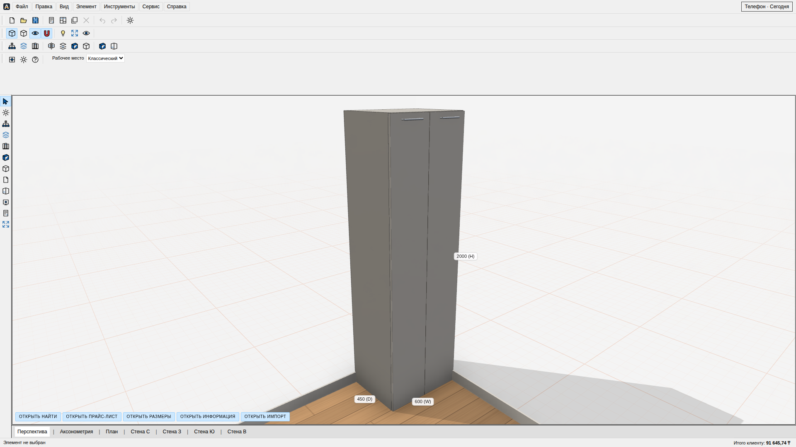
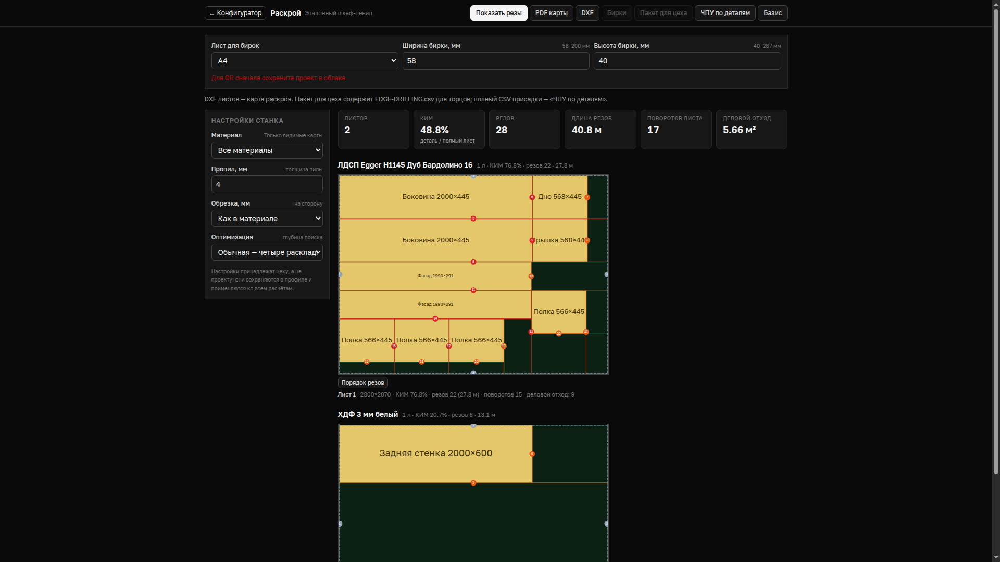
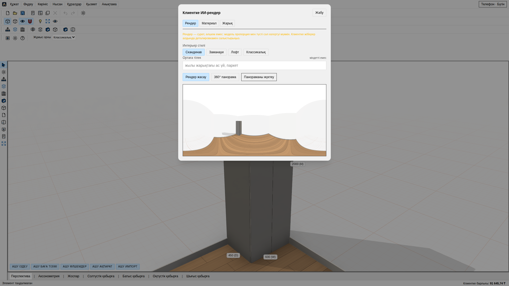

# AisMebel: руководство пользователя

Названия кнопок приведены как в интерфейсе. Габариты шкафа всегда вводите в порядке **H × W × D**, целыми миллиметрами: например, 2000 (H) × 600 (W) × 450 (D). «Готовый» — размер собранной детали, «Рез» — размер для пилы.

## Начало за 10 минут

1. При наличии интернета откройте `/configurator`. Владелец регистрирует мастерскую через «Аккаунт» и приглашает сотрудников в «Команда». Для первого входа на телефоне тоже нужен интернет.
2. Выберите шаблон в «Создать» или создайте помещение и корпус. Проверьте размеры, материал, фасады, полки и кромку. «Проект → Сохранить» скачивает JSON; «Проекты в облаке → Сохранить текущий» сохраняет проект на сервере после входа.
3. В «Смета и раскрой → Стоимость» проверьте цены и скачайте PDF «КП». Пока цены заполнены не полностью, КП не выпускается. Передайте клиенту ссылку и код через «Проект → Ссылка клиенту».

| Кто | Первое действие | Текущая роль доступа |
|---|---|---|
| Владелец | Пригласить сотрудников в «Аккаунт → Команда», проверить материалы, цены и правила в «Настройки цеха» | `owner` |
| Менеджер | Заполнить «Проект → Реквизиты», выпустить КП и отправить ссылку на согласование | Отдельной роли нет; для правки проекта `designer` |
| Замерщик, телефон | `/mobile → Новый замер`: помещение, четыре стены, препятствия и фото; затем «Сохранить замер» | Отдельной роли нет; `designer` либо `owner` |
| Дизайнер | Открыть замер, перейти в «Новая КП»/`/configurator`, проверить 3D, детали и присадку | `designer` |
| Распил/CNC | На `/cut` проверить листы и отходы; скачать «PDF карты», «DXF», «ЧПУ по деталям» или «Всё для цеха» | `shop` читает производственные данные; доступ к экспорту проверьте отдельно |
| Кромка | Сверить L1/L2/W1/W2, материал и размер «Рез» на бирке и в деталировке | `shop`; отдельного статуса кромления нет |
| Монтажник, телефон | `/mobile → Монтаж`: фото, подпись клиента, акт дефекта, ремонт; затем «Завершить монтаж» | `shop` либо `owner` |
| Клиент | Открыть 3D по ссылке или коду `/c`; оставить комментарий, подтвердить версию отдельным шестизначным кодом | Ссылка клиента, без членства в команде |

Роль `shop` не видит внутренние цены и не редактирует проект. Для замерщика сейчас нужен доступ `designer`, для монтажника — `shop`; отдельных аккаунтных ролей для этих профессий пока нет.

## Путь заказа

1. **Замер.** В `/mobile → Новый замер` заполните стены, препятствия и обязательные фото. «Голос» и «Лазер» отмечают лишь источник введённого вручную числа. Без сети замер остаётся на телефоне и попадает в очередь. Проверьте, что «Ожидает отправки» стало нулём.
2. **Проект.** В `/configurator` разместите корпус, проверьте 3D и «Деталировка». В «Проект → Реквизиты» внесите клиента, номер заказа и дизайнера. Сохраните JSON либо проект в облаке через аккаунт.
3. **КП.** Заполните цены в «Настройки цеха», затем скачайте «Смета и раскрой → Стоимость → КП». Проверьте материалы, кромку, фурнитуру, услуги и скидку.
4. **Печать согласования.** В «Проект → Ссылка клиенту → Отправить версию на согласование» укажите точную итоговую сумму. Передайте клиенту код подтверждения: он показывается один раз. Клиент онлайн нажимает «Подтверждаю эту версию» на `/view` и скачивает PDF с печатью. После изменения проекта отправьте новую версию. Печать фиксирует версию/цену; бумажный договор автоматически не создаётся.
5. **Производство.** На `/cut` скачайте карту раскроя и DXF листов. Архив «ЧПУ по деталям» содержит отдельный файл присадки на каждую деталь и `index.csv`: сверяйте координаты с резом именно этой детали. «Пакет для цеха» содержит раскрой, DXF деталей, CSV деталировки и бирки. Для QR на бирках сначала сохраните проект в облаке; экспорт проверит, что серверная версия совпадает с локальной. После изменений сохраните проект в облаке снова. `/mobile/scan` читает QR или введённый код.
6. **Монтаж.** В `/mobile/installation` откройте задание, сохраните фото и подпись клиента. При дефекте заполните «Акт о дефекте» с деталью и фото, закройте ремонтное задание, затем завершите монтаж.
7. **Оплата.** Мастерская вручную выставляет аванс и остаток в своём Kaspi Pay POS, проверяет платежи в истории банка и выдаёт чек. В ядре есть `financeTotals`, но отдельной финансовой панели и автоматической проверки банка пока нет. Статус «оплачено» подтверждайте по банковской записи.

## Внешний вид материала и панорама

В «Свойства → Материал» выберите материал и задайте шероховатость, sheen и clearcoat от 0 до 1, отражение от 0 до 2. Для AO укажите URL карты в оттенках серого по HTTP(S), её размеры в целых миллиметрах и силу. Эти параметры меняют только 3D, без изменения распила и цены. «Файл → Экспорт → Панорама 360°» скачивает PNG; «Рендер → Панорама 360°» показывает предварительный просмотр.

## Рыночные цены и MCP

Метка рекомендованной цены или рыночной медианы в «Настройки цеха» служит ориентиром. Введённая вами цена становится ценой мастерской и не заменяется при обновлении рынка. «Вернуть цены по умолчанию» заменяет её после подтверждения.

Локальный MCP сервер даёт девять инструментов: проект из текста, смету, деталировку, раскрой, поиск материалов, присадку, проверку конфигурации и список/открытие проектов. Он запускается отдельно и требует токен owner/designer. Удалённый коннектор Claude/ChatGPT пока не готов. Настройка и ограничения описаны в [руководстве MCP](../mcp/README.md).

## Работа с сетью

Замер, фото и действия монтажа сохраняются на телефоне и отправляются после восстановления связи. Следите за количеством в очереди и состояниями «Нет сети / Сервер недоступен». При «Конфликт замера» сравните версии и явно выберите «Оставить мою» или «Оставить серверную»; при «Отправка замера отклонена» исправьте причину и нажмите «Повторить отправку». Первый вход, загрузка из облака, приглашения, публикация для клиента, код согласования, AI и банковская ссылка требуют сеть. Перед выездом откройте нужный проект на этом телефоне и не очищайте данные браузера. Часть общего списка офлайн возможностей ещё не подключена к UI полностью: производственные PDF/DXF лучше скачать заранее.

## Базис и PRO100

- **Базис:** скачайте `/cut → Базис`. `detali.csv`/`detali.xlsx` передаются в Базис-Раскрой как **готовые размеры**; выберите «Длину и ширину считывать как готовую». Скопируйте `bazis-import.js` в папку `Scripts` Базис-Мебельщика и запустите в новой модели. При первом запуске сопоставьте крепёж и кромку в «Свойства», затем нажмите «Построить». Проверьте `...-bazis-audit.json`, диаметры/глубины отверстий и пропущенную геометрию. Если предупреждение указывает на казахские буквы, переименуйте детали по-русски или латиницей: Windows-1251 заменяет их на `?`. Работа скрипта в реальном Базисе цеха ещё не подтверждена; сделайте пробную деталь до раскроя заказа. [Подробности](../basis/script-export.md).
- **PRO100:** это Windows мост сравнения через интерфейс PRO100 v7.08, а не двусторонний производственный импорт. Проверяющий создаёт набор `npm run pro100:kit -- --out <папка>`, в Windows с открытым PRO100 запускает `pro100-bridge.exe audit pro100-test-kit.json` и разбирает `pro100-audit.json` через `npm run pro100:audit -- <файл>`. Для анализа старого проекта откройте его в PRO100 и выполните `pro100-bridge.exe export-project`; полученный JSON не загружается в AisMebel автоматически. Прямое открытие `.sto`/`.meb` и полная совместимость форматов — **в плане**. [Инструкция моста](../../tools/pro100-bridge/TESTER-RU.md).

## Частые ошибки

| Признак | Решение |
|---|---|
| Не выходит КП | Заполните цены материалов, кромки, фурнитуры и услуг в «Настройки цеха». |
| Размер детали отличается на 3–4 мм | Сравните «Готовый» и «Рез»: толстая кромка вычитается из размера распила. |
| Клиент видит «Проект изменился» | Отправьте новую версию на согласование, не используйте старую печать. |
| QR не находится | Сохраните проект в облаке снова, выпустите бирки той же версии и загрузите проект на телефон. |
| Телефон не отправляет | Проверьте сеть и очередь, разрешите конфликт выбором версии или повторите отклонённую отправку после исправления причины. |
| В Базисе нет отверстия/кромки | Проверьте сопоставление и audit: некоторые формы передаются только как прямоугольник. |
| PRO100 показывает расхождение | Сверьте конструкцию корпуса, материалы, кромку и цены. Подтверждённый внешний экспорт есть только для одного сценария. |

## Словарь

**Деталировка** — список панелей, количества, материалов и размеров распила. **Раскрой** — размещение деталей на листах и карта резов. **Присадка** — координаты и диаметры отверстий. **Кромка** — облицовка торца; L1/L2 — длинные, W1/W2 — короткие стороны. **КП** — коммерческое предложение клиенту в PDF. **Печать согласования** — PDF с зафиксированными версией, ценой и временем подтверждения. **Бирка** — этикетка детали с названием, размером и кромкой. **DXF** — файл чертежа для станка. **CNC/ЧПУ** — станок с числовым программным управлением. **Очередь** — действия телефона, которые будут отправлены на сервер позднее.
