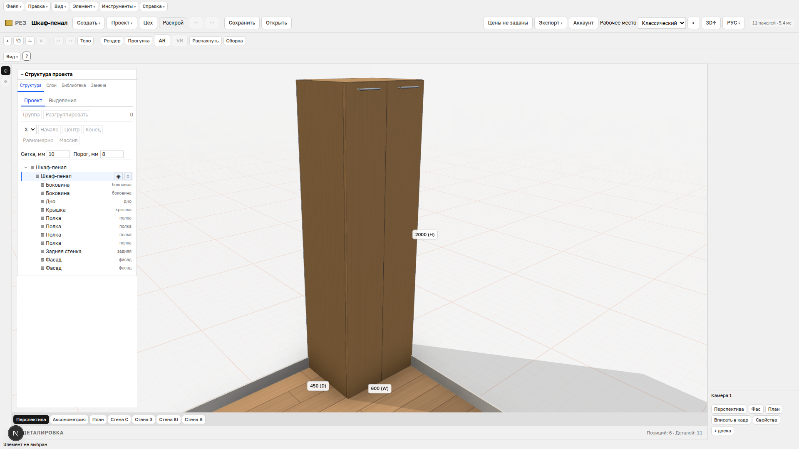
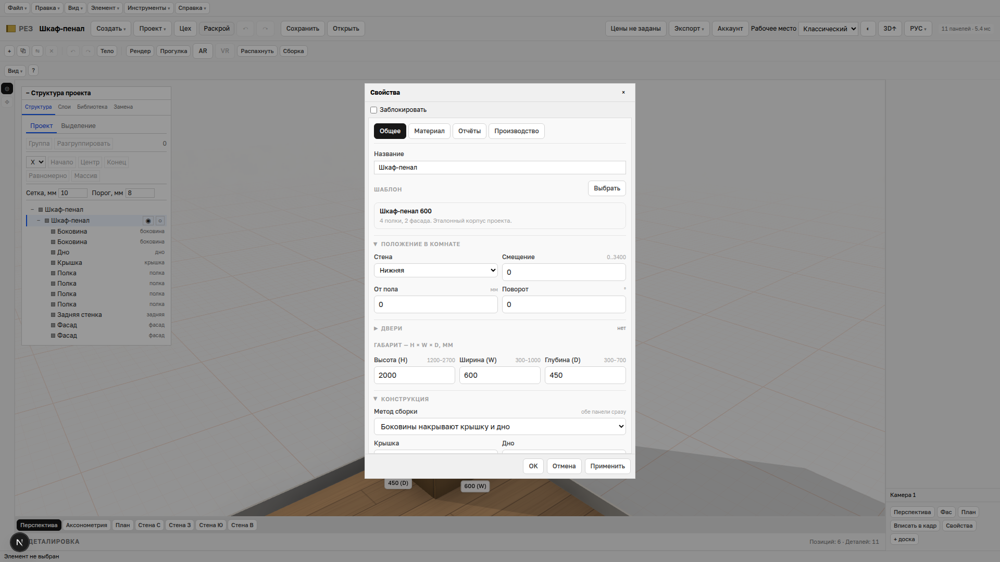
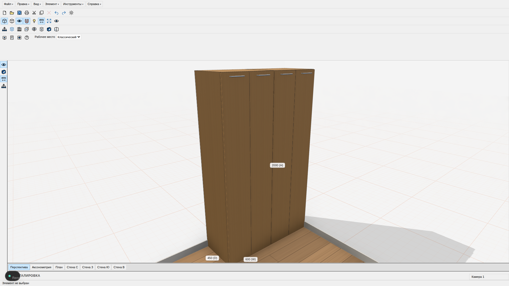
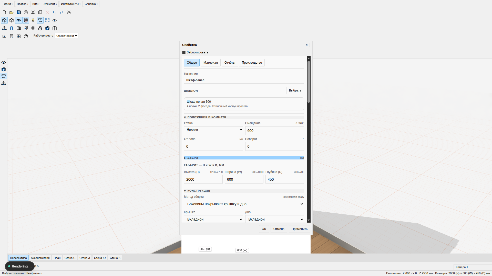
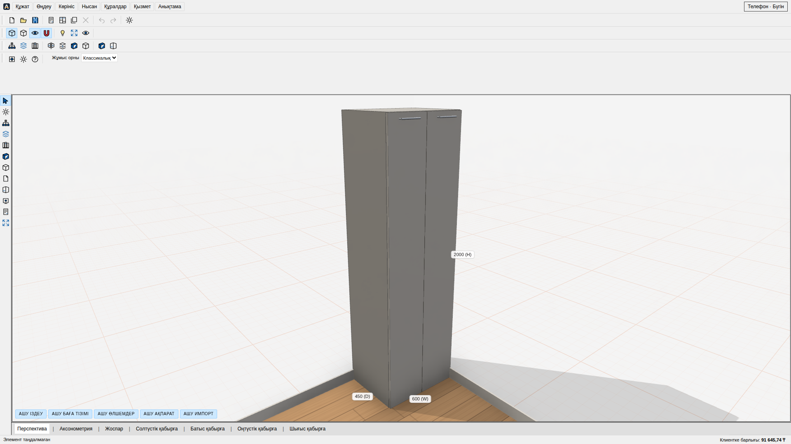
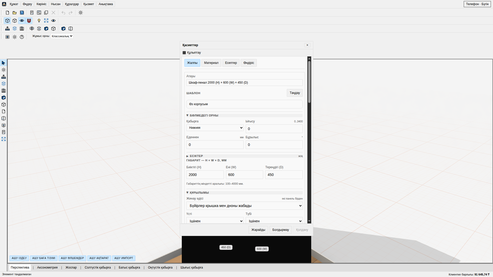
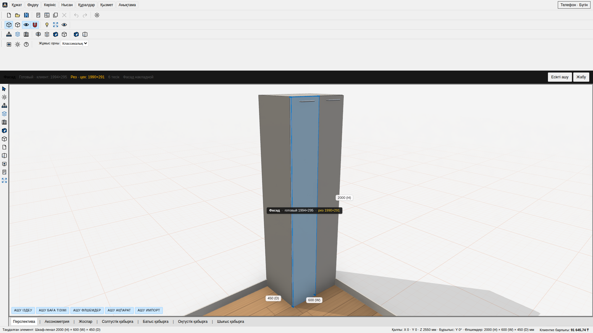

# PRO100 v7.08 пен біздің классикалық десктоп

Эталон: PRO100 v7.08-дің `.codex-runs/pro100-ref/ui/` ішіндегі суреттері (репоға қосылмайды). Біздің кадрлар 1920 × 1080 пиксель viewport-та Playwright/Chrome арқылы 2026-09-25 күні алынды. Эталондағы шкафтың өлшемі мен камера қашықтығы бөлек, сондықтан салыстыру интерфейс құрылымына арналған.

| PRO100 v7.08 | Классикалық жұмыс кеңістігі |
|---|---|
|  |  |

| PRO100 v7.08 Properties | Біздің Properties |
|---|---|
|  |  |

| Аймақ | Эталон | 03d іске асқан нұсқа | Айырмашылық |
|---|---|---|---|
| Жоғарғы бөлік | Мәзір мен бірнеше белгіше қатары | Мәзір және қолданыстағы әрекеттердің құралдар қатары | Біздің басқару элементтеріміз негізінен мәтіндік; қатарлар мен батырмалар биігірек |
| Сол жақ | Тар тік құралдар | Таңдау және сахнада жылжыту нұсқауы | Толық құралдар жиыны кейінгі жұмыс |
| Орта | Ақ бөлме, жылы қызғылт тор, шкаф бөлме ішінде шағын көрінеді | Ақ 3D сахна, палитрадағы тор реңкі, шкаф жақыннан көрінеді | Камера масштабы және бөлме геометриясы бөлек; біздің еден текстурасы мен қабырға әшекейі бар |
| Оң жақ төмен | Camera 1 | Пресеттері бар Camera 1 панелі | Бізде бұл панель нақты әрекет жасайды |
| Төмен | Көрініс қойындылары, күй жолағы | Бар камера пресеттеріне жалғанған қойындылар, таңдау/орын/H × W × D күйі | Күй жолағында өлшемдер әрқайсысы әріппен беріледі |
| Properties | Lock, General, Material, Reports, OK/Cancel/Apply | Осы құрылым және біздің Production | Біздің терезе биігірек әрі мазмұны айналдырылады; General ішінде бар шкаф баптаулары да тұр |

PRO100 PNG файлдары жергілікті эталон бумасында ғана сақталады. Өзіміздің екі кадр репода бар; эталон сілтемелері эталон бумасы жоқ ортада ашылмайды.

## 03d3 — 2026-09-26, екінші айналымның аяқталған бөлігі

Екі жаңа кадр Chrome CDP/Playwright сценарийімен дәл 1920 × 1080 viewport-та
алынды; бірінші іске қосу галереясы мен оқыту қабаты жабылған. Эталон кадрларын
репозиторийге қоспаймыз.

| PRO100 жұмыс кеңістігі | 03d3 классикалық кеңістік |
|---|---|
|  |  |

| PRO100 Properties | 03d3 Properties |
|---|---|
|  |  |

| Аймақ | Баға | Нақты айырмашылық |
|---|---|---|
| Мәзір және құралдар | жақын | 4 қатар 18 px өз SVG белгішелері бар, бірақ эталонда 5 қатар және басқа толық топтау бар |
| Сол жақ құралдар | жақын | 28 px, 4 әрекет; эталондағы кей өлшеу және өңдеу құралдары жоқ |
| Structure | сәйкес | Әдепкі жабық, белгішеден ашылады, жабылады және тақырыптан сүйреледі; ішкі ағаш біздің функциялармен кеңірек |
| 3D сахна | бөлек | Ақ фон/қызғылт тор бар, бірақ шкаф тым үлкен, ағаш еден мен жиек әлі бар; көк таңдау маркерлері жоқ |
| Properties | бөлек | Қараңғы өрістер жойылды; General реті, құлыптар, өлшем fieldset және Position әлі эталонға сай емес |
| «Наш» режимі | сәйкес | Бұрынғы басқару тобы стиль ауыстырғанда қайта көрінеді; e2e тексерді |

5 × 5 px бір түсті дақтардың орташа RGB мәндері алынды; есеп — `skimage.color`
`rgb2lab` және `deltaE_ciede2000`. Әртүрлі кадр биіктігі/диалог орны үшін
координаттар семантикалық бірдей бос бетке сәйкестендірілді.

| Бет | Эталон пикселі → RGB | Біздің пиксель → RGB | ΔE00 |
|---|---|---|---:|
| Құрал фоны | `(500,58)` → 240,240,240 | `(500,50)` → 240,240,240 | 0.00 |
| Бос сахна | `(200,300)` → 255,255,255 | `(200,300)` → 243,243,243 | 2.42 |
| Қойынды жолағы | `(800,998)` → 223,223,223 | `(800,1000)` → 223,223,223 | 0.00 |
| Күй жолағы | `(500,1021)` → 240,240,240 | `(500,1065)` → 240,240,240 | 0.00 |
| Properties ішкі беті | `(825,600)` → 249,249,249 | `(730,600)` → 243,243,243 | 1.18 |

Fieldset жиегі мен өлшем батырмаларының құрылымы әзірге бірдей емес: олар
үшін ΔE талапты «өтті» деп бағалауға болмайды. Бұл 03d3-тің келесі кезегіне
қалған нақты жұмыс.

## H-08 — 2026-09-27, P2 салыстыруы

`scripts/e2e-h08.mjs` жергілікті сервер мен Chrome SwiftShader арқылы 1920 × 1080 кадрларды түсірді. Оқыту қабаты жабық. Дизайн аудитінің `compare/c1-workspace.png`, `c2-properties.png`, `c8-toolbar-zoom.png`, `c9-tabs-status.png` жұптарындағы құрылым салыстырылды. PRO100 белгішелері көшірілмеді: сол жақтағы жаңа әрекеттер өз SVG белгішелерімен берілді.

| PRO100 v7.08 | H-08 классикалық кеңістік |
|---|---|
|  |  |

| PRO100 Properties | H-08 Properties |
|---|---|
|  |  |

5 × 5 px біркелкі алаңның орташа RGB мәні, `skimage.color` CIEDE2000. Координаттар семантикалық бірдей өңірлерден алынды; бұлар толық сурет ұқсастығының ұпайы емес.

| Алаң | PRO100 RGB | H-08 RGB | ΔE00 |
|---|---|---|---:|
| Құрал фоны | 240,240,240 | 240,240,240 | 0.00 |
| Бос сахна | 255,255,255 | 243,243,243 | 2.42 |
| Көрініс қойындысы фоны | 223,223,223 | 223,223,223 | 0.00 |
| Күй жолағы | 240,240,240 | 240,240,240 | 0.00 |
| Properties ішкі беті | 249,249,249 | 247,247,247 | 0.41 |

P2 құрылымдық айырмашылықтары: көрініс қойындылары енді `|` арқылы бөлінеді және белсендісі ақ; жолақтарда грипер/топ бөлгіші бар; сол жақта 12 жұмыс істейтін әрекет; Properties бөлімінде fieldset рамкасы бар; ашық емес деталировка тақырыбы сахнаны тарылтпайды; таңдалған деталь көк және 8 тұтқалы. Бос сахнаның ΔE өзгермеді, себебі P2-де сахна фоны өңделген жоқ. PRO100 каталогы мен Reports құрылымы әлі бөлек.
